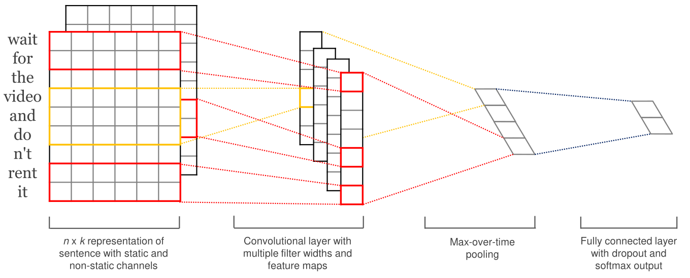
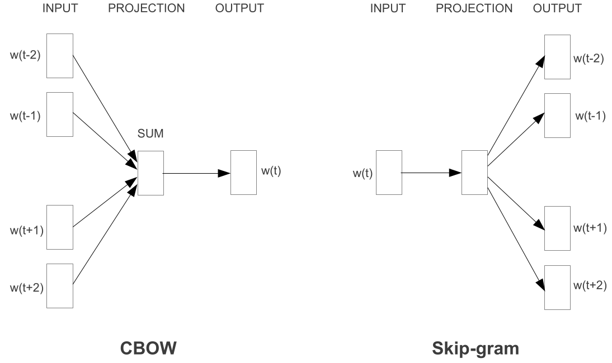

# 1. CNN for NLP

The model architecture is shown as follows

First, each word is represented as a vector $\bold{x_i} \in \mathbb{R}^k$. Thus, a sentence of length $n$ is represented as
$$
\bold{x}_{1:n} = \bold{x}_1 \oplus\bold{x}_2\oplus \cdots\oplus \bold{x}_n
$$
A convolution operation involves a filter $\bold{w} \in \mathbb{R}^{h\times k}$, which is applied to $h$ words, and generates a feature $c_i$, by
$$
c_i = f(\bold{w}\cdot \bold{x}_{i:i+h-1} + b)
$$
After convolution, we get a feature map
$$
\bold{c} = [c_1, c_2, \dots, c_{n-h+1}]
$$
With multiple filters (with varying $h$), we can generate $m$ different feature maps, denoted as $\bold{c}_i$. We then apply a max-over-time pooling operation over each feature map and take the maximum value $\hat c_i$ as the feature corresponding to each filter.

These features are passed to a fully connected softmax layer with dropout to generate the probability distribution over labels.

## 2. Word Embedding

## 2.1 Word2Vec

There are 2 different models: CBOW and skip-gram, whose architectures are shown as follows.

For the CBOW model, every word is represented as a one-hot vector $\bold{x_i} \in \mathbb{R}^{1\times V}$. For a specific word $\bold{x}_i$, we train the model to use $\bold{x}_{i-k:i-1}$ and $\bold{x}_{i+1:i+k}$ to predict it.

Specifically, we use a projection matrix $\bold{W} \in \mathbb{R}^{V\times D}$ to generate the projection $\bold{h}_j \in \mathbb{R}^{1\times D}$ of each context word $\bold{x}_j, j = i-k, \dots,i-1, i+1, \dots, i+k$. Then, we calculate the average of these $2k$ vectors as 
$$
\bold{h} = \dfrac{1}{2k}\sum_j \bold{h}_j
$$
This vector is then passed to a softmax layer with an output matrix $\bold{W'}\in \mathbb{R}^{D\times V}$ and bias vector $\bold{b} \in \mathbb{R}^{1\times V}$, to generate the probability distribution over the vocabulary.

Finally, the projection matrix $\bold{W}$ is the word embedding we need. Since the input words are represented as  one-hot vectors, computing $\bold{x}_i \cdot \bold{W}$ yields exactly the $i$-th row. Thus, it is natural to consider $\bold{W}$ as the final word embedding. 

The Skip-gram model is similar to the CBOW model. The main task becomes predicting words $\bold{x}_{i-k:i-1 , i+1:i+k}$ with word $\bold{x}_i$. For a specific word $\bold{x}_i$, each of its $2k$ context words  $\bold{x}_j$ forms an independent training pair $(\bold{x}_i,  \bold{x}_j)$. The model is trained on all such pairs from the entire corpus, typically by sampling them randomly (with or without batching).

> **Key Optimizations**
>
> Typically, the softmax layer needs to calculate the probability distribution:
> $$
> P(w_j|w_c) = \dfrac{\exp(u_j)}{\sum_{i=1}^V\exp(u_i)}
> $$
> which causes a great computational cost. To address this problem, two optimizations are introduced.
>
> **Hierarchical Softmax**
>
> Using a Huffman tree to encode all the words, this method transforms the  $V$-classification problem into a series of binary classification  problems. The leaves of the tree represent words, and each internal node has a trainable parameter vector that acts as a binary classifier.
>
> To compute $P(w_o|w_c)$, only the classifiers along the unique path from  the root to the word $w_o$ are evaluated. The probability is the product of the binary probabilities along this path. Thus, the computational  complexity is reduced to $O(\log V)$.
>
> **Negative Sampling**
>
> Instead of computing the expensive softmax over the entire vocabulary, this  method simplifies the task into a binary classification problem. For  each training pair $(w_c, w_j)$ (center word, true context word):
>
> - **Positive sample**: $(w_c, w_j)$ — the model learns to assign a high probability to this pair.
> - **Negative samples**: Randomly select $K$ words $w_1, w_2, ..., w_K$ from the vocabulary  (excluding $w_j$) to form $K$ negative pairs $(w_c, w_k)$ — the model  learns to assign low probabilities to these pairs.
>
> The training objective is to maximize the probability for the positive  sample while minimizing it for the $K$ negative samples. This means only $K+1$ output vectors need to be updated per training step, instead of  the entire vocabulary.
>
> The sampling distribution is:
> $$
> P(w) = \dfrac{f(w)^{3/4}}{\sum_{i = 1}^Vf(i)^{3/4}}
> $$
> where $f(w)$ is the frequency of word $w$. The $3/4$ power gives slightly more weight to less frequent words.

## 2.2 GloVe

This model aims to generate word representations that leverage global corpus statistics.

First, we build a word-word co-occurrence matrix $X$, where $X_{ij}$ represents the total weighted count of word $j$ appearing in the context of word $i$. The weight is defined as $1/d$, with $d$ being the distance between word $j$ and word $i$ in each occurrence. Let $X_i=\sum_kX_{ik}$ and $P_{ij}=P(j∣i)=X_{ij}/X_i$ be the probability that word $j$ appears in the context of word $i$.

For each word $i$, the model learns four parameters:

- $w_i$: main vector of word $i$
- $\tilde{w}_i$: context vector of word $i$
- $b_i$: main bias of word $i$
- $\tilde{b}_i$: context bias of word $i$

The authors derive that these parameters should satisfy:
$$
w_i^T\tilde{w}_j+b_i + \tilde{b}_j = \log X_{ij}
$$
This is converted into a weighted least squares loss function:
$$
J = \sum_{i,j=1}^Vf(X_{ij})(w_i^T\tilde{w}_j + b_i + \tilde{b}_j - \log X_{ij})^2
$$
The weighting function $f(X_{ij})$ is defined as:
$$
f(x) = \begin{cases}
(x / x_{\max})^\alpha, &\text{if } x < x_{\max}\\
1, &\text{otherwise}
\end{cases}
$$
with typical values $x_{\max}=100$ and $α=3/4$. This function down-weights rare co-occurrences (which are noisy) and caps the influence of extremely frequent co-occurrences (which could otherwise dominate training).

After training, the final word embedding for word $i$ is taken as $w_i+\tilde{w}_i$, combining information from both the main and context vectors.

> **Why Global Information Matters**
>
> For low-frequency words, local models (like Word2Vec) may be confused by  different contexts—they can't tell which contexts are truly important.
>
> GloVe solves this by using **ratios of co-occurrence probabilities**, not raw probabilities. So a low-frequency word can learn from the  high-frequency words it co-occurs with. These high-frequency words already have good  representations, and the low-frequency word's vector gets positioned  based on them.
>
> This is somewhat like pre-training and fine-tuning.

# 3. Dropout

This method aims to tackle the  problem of overfitting. For every layer, each neuron will be dropped out with the probability of $1-p$ ( $p$ may vary across layers). During  backpropagation, the weights of the dropped-out neurons will not be updated, while gradients continue to pass backward through them.

During prediction, no neurons are dropped out, but the weight of each neuron  is multiplied by $p$ to maintain the same expected output as in the  training phase. (A more commonly adopted approach is to multiply the output of each neuron by $1/p$ during training and keep the weights unchanged during testing.)