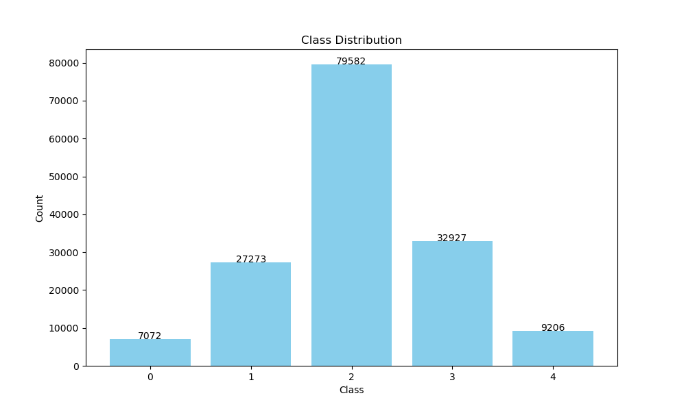

# Task-2: 基于深度学习的文本分类

## 一、实验目的

​	通过实现 $\text{CNN、RNN、Transformer}$ 三种深度学习模型，掌握 $\text{Pytorch}$ 实现深度学习的基本方法，并分析不同损失函数、学习率、不同卷积核大小、卷积核数量以及优化器对卷积神经网络的影响，最后探究了 $\text{GloVe}$ 预训练词向量对训练的影响，并对比了三种模型在特定文本分类任务下的性能。

## 二、实验环境

- **平台：**$\text{Kaggle Notebook（GPU T4 $\times$ 2）}$
- **语言：**$\text{Python 3.10}$
- **核心工具包：**$\text{scikit-learn, PyTorch, numpy, pandas}$

## 三、实验数据

​	数据来源：`Will Cukierski. Sentiment Analysis on Movie Reviews.  https://kaggle.com/competitions/sentiment-analysis-on-movie-reviews,  2014. Kaggle.` 类型分布如下图：

​	可见，数据分布极度不均匀，这也是限制模型能力的关键问题。

## 四、实验设计

### 实验一：测试不同损失函数、学习率对最终分类的影响

#### 实验内容

- `Loss_func` 参数选择：`cross_entropy, MSE, hinge, perceptron`
- `learning_rate` 参数选择：`0.0001, 0.001, 0.01, 0.1`

#### 实验结果

### 实验二：测试不同卷积核大小、个数以及优化器对最终分类的影响

#### 实验内容

- `filter_size` 参数选择：`[2,3,4], [3,4,5], [4,5,6], [5,6,7]`
- `num_filter` 参数选择：`50, 100, 150, 200`
- `optimizer` 参数选择：`adam, sgd, rmsprop`

#### 实验结果

### 实验三：测试 $\text{GloVe}$ 预训练词向量对最终分类的影响

#### 实验内容

- `use_glove` 参数选择：`True, False`

#### 实验结果

### 实验四：测试不同深度学习模型对最终分类的影响

#### 实验内容

- `model` 参数选择：`CNN, RNN, Transformer`

#### 实验结果

## 五、实现结果分析

### 实验一

​	关于不同损失函数对于准确率的影响，在任务一的实验报告中已经进行了分析。这里主要分析，在使用 `perceptron` 损失函数时观察到的现象：
$$
\begin{array}{c|c|c}
\hline
\text{Epoch} & \text{Train Loss} & \text{Val Acc}\\
\hline
1/50 & 0.2002 & 0.5244\\
5/50 & 0.0022 & 0.4650\\
10/50 & 0.0001 & 0.4451\\
15/50 & 0.0000 & 0.2268\\
20/50 & 0.0000 & 0.4973\\
25/50 & 0.0000 & 0.4989\\
30/50 & 0.0000 & 0.1830\\
35/50 & 0.0000 & 0.0693\\
40/50 & 0.0000 & 0.5007\\
45/50 & 0.0000 & 0.0673\\
50/50 & 0.0000 & 0.1811\\
\end{array}
$$
​	可以发现，训练集损失率迅速降低到 $0.0000$，这是因为 `percoptron` 函数只考虑错误分类的样本，当训练集中的样本全部分类正确之后，权重将不再更新，导致模型并不具备良好的泛化能力。

### 实验二

​	通过实验数据可以观察到，当卷积核设置为 `[2,3,4]` 时，可以取得明显较好的结果。因此，进行如下延伸实验并得到结果
$$
\begin{array}{c|c}
\hline
\text{filter\_size} & \text{test acc}\\
\hline
[2, 3] & 0.62906\\
[3, 4] & 0.63063\\
[2, 4] & 0.62864\\
[4, 5] & 0.62800\\
[2] & 0.62758\\
[3] & 0.62882\\
[4] & 0.62843
\end{array}
$$
​	可以发现，当长度为 `2,3,4` 的特征结合时，可以达到最好的效果，从中去除任何一种特征，性能都有所下降。可见，长度为 `2,3,4` 的特征都很重要，都可以帮助模型学习到更好的特征。因此，从卷积核大小为 `[3,4]`的实验来看，`[3,4,5]`的准确率下降似乎可以解释为，长度为 `5` 的特征并不适合学习，为模型引入了噪声。

​	但当卷积核的大小为`[4,5]`时，其效果又远超出 `[3,4,5]`与 `[4,5,6]`两个模型，因此我认为，加入长度为 `5` 的特征实际上导致了模型过拟合，

​	因此，当特征长度较短时，多个大小的卷积核可以互相弥补，提高模型准确率，而特征长度较长时，则有可能引起模型的过拟合，此时，多个大小的卷积核互相弥补的作用就被过拟合抵消掉了。

### 实验三

​	通过实验发现，使用了 `GloVe` 词向量初始化之后，准确率明显提高，这是非常自然的结果。

​	在实验过程中发现：使用了 `GloVe` 初始化后，第一个 `Epoch` 时的验证集准确率明显提升，而随后，准确率首先出现了明显的下降，又再次攀升，最后达到了最高准确率。

​	我认为，这是因为 `GloVe` 是静态词向量，每个向量已经具备较好的语义，因此初始准确率较高；而在微调以适配当前任务的过程中，破坏了原本的语义，因此准确率下降；随着微调的进行，重新建立起较好的语义，准确率因此回升。

​	并且，在仅仅 `50` 个 `Epoch` 内，进行了初始化的词向量就完成了微调，达到了超过原有模型的效果，充分反映了“预训练-微调”模式的重要性。

### 实验四

​	通过实验发现，`CNN` 的效果与 `RNN` 相差不大，但都好于 `Transformer`。反映了 `Transformer` 模型在短文本中的局限性。由于数据集规模较小，`CNN` 的先验假设可以为 `CNN` 带来更好的性能，而 `Transformer` 没有任何先验假设，因此在小数据集上表现略逊于 `CNN`。（该观点在论文 `An Image is Worth 16x16 Words: Transformers for Image Recognition at Scale` 中亦有提到） 