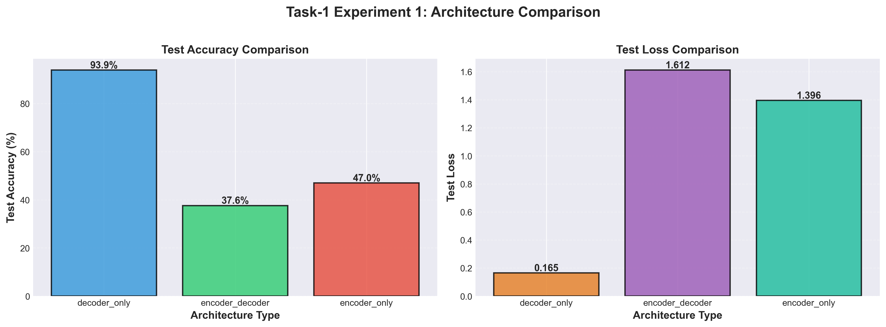
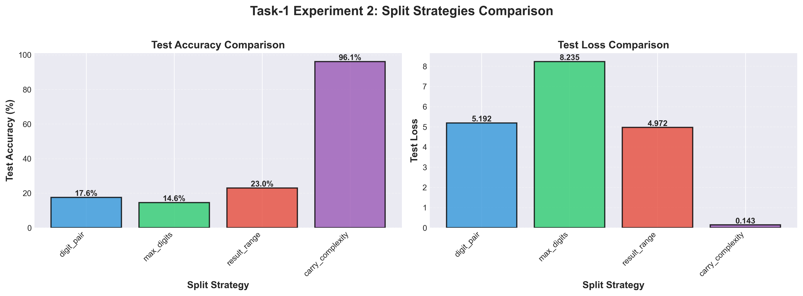
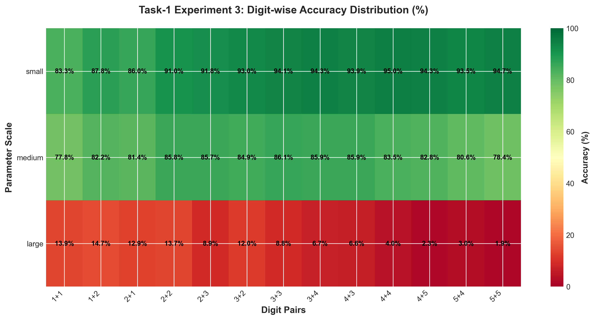
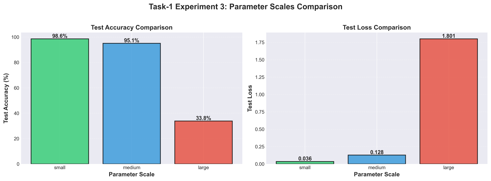
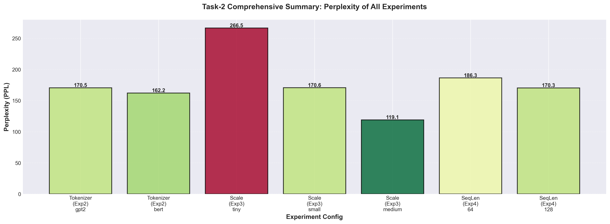
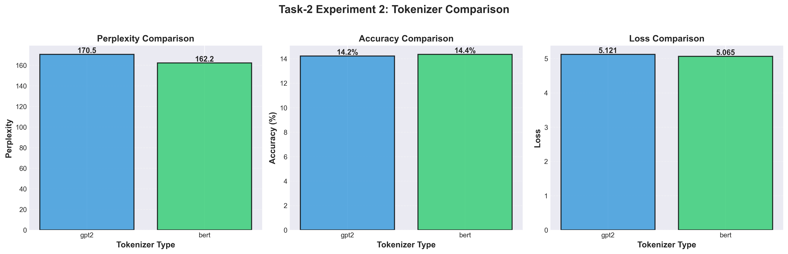
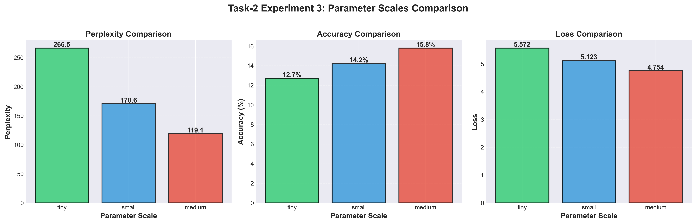
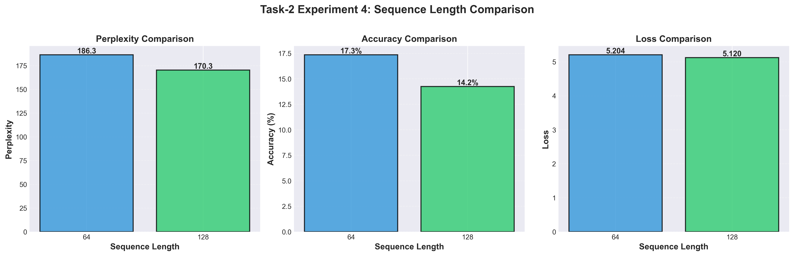

# Task-3: 实现 Transformer 的基础架构

## 一、实验目的

​	实现 $\text{Transformer}$ 的基础架构，并通过自己生成数据集完成 $\text{Transformer}$ 在多位数加法和语言模型两个任务上的训练，并测试不同的数据集划分方式、不同的架构、不同的参数规模、不同的 $\text{Tokenizer}$ 和不同的词表大小等对模型效果和泛化能力的影响。

## 二、实验环境

- **平台：**$\text{Kaggle Notebook（GPU T4 $\times$ 2）}$
- **语言：**$\text{Python 3.10}$
- **核心工具包：**$\text{transformers (用于预训练的 Tokenizer), PyTorch, numpy, pandas}$

## 三、实验数据

### 任务一：多位数加法任务

数据来源：自定义生成的加法数据集

数据格式：
- 数据集文件：`Data/dataset/addition.txt`
- 数据格式：`num1+num2=result`（例如：`12+34=46`）
- 词汇表：
  - 特殊标记：`<pad>`（填充）、`<sos>`（开始）、`<eos>`（结束）、`<unk>`（未知）
  - 数字：`0-9`
  - 运算符：`+`, `=`
- 输入格式：`[SOS, n1, +, n2, =, EOS]`
- 目标格式：`[SOS, result_digits, EOS]`

### 任务二：语言建模任务

数据来源：WikiText-103 数据集

数据格式：
- 数据集来源：HuggingFace datasets
- 训练集大小：500,000 样本（可配置）
- 数据类型：英文维基百科文本
- Tokenizer：支持 GPT2、BERT、RoBERTa 三种预训练分词器
- 序列长度：可配置（64/128/256/512）

## 四、实验设计（任务一）

### 实验一：架构对比

#### 实验内容

- `architecture` 参数选择：`encoder_decoder, decoder_only, encoder_only`
- 参数规模：`medium`
- 数据划分：`random（70%/15%/15%）`
- 训练配置：批次大小 `32`，学习率 `0.001`，训练轮数 `100`，优化器 `Adam`

#### 实验结果

### 实验二：数据划分策略泛化

#### 实验内容

- `split_strategy` 参数选择：`random, digit_pair, max_digits, result_range, carry_complexity`
- 架构：`encoder_only`
- 参数规模：`medium`

#### 实验结果

### 实验三：参数规模影响

#### 实验内容

- `model_size` 参数选择：`small, medium, large`
- 架构：`encoder_only`
- 数据划分：`random`

#### 实验结果

## 五、实验设计（任务二）

### 实验一：Tokenizer 对比

#### 实验内容

- `tokenizer` 参数选择：`gpt2, bert, roberta`
- 架构：`decoder_only`
- 参数规模：`small`
- 最大序列长度：`128`

#### 实验结果

### 实验二：参数规模影响

#### 实验内容

- `model_size` 参数选择：`tiny, small, medium, base`
- 架构：`decoder_only`
- Tokenizer：`GPT2`
- 最大序列长度：`128`

#### 实验结果

### 实验三：序列长度影响

#### 实验内容

- `max_seq_len` 参数选择：`64, 128, 256`
- 架构：`decoder_only`
- Tokenizer：`GPT2`
- 参数规模：`small`

#### 实验结果

## 六、实验结果分析（任务一）

### 实验一

​	从实验结果中可以看出，`decoder-only` 架构的效果最好，远好于其他两种架构，而 `encoder-decoder` 的效果很差，可以说几乎没有学会加法，`encoder-only` 架构的表现同样不尽人意，下面试分析其原因。

​	`encoder-only` 架构本身并不适合多位数加法这种生成式任务，因为其注意力机制（这里采用的是 `BERT` 架构）是双向的，会导致训练-推理不一致——训练时可以通过 `MLM` 看到所有掩码位置（包括“未来”的结果位），但推理时却需要独立预测各位置。因此，即使训练数据覆盖了各种位数组合，其准确率仍然很低。

​	`encoder-decoder` 架构理论上应当可以胜任序列生成任务，但这里却表现得十分差劲。根本原因在于，我在此实验中实现的是原始的 `Transformer`，采用的是绝对位置编码。在这种编码下，`encoder` 和 `decoder` 各自使用独立的绝对位置索引，当 `decoder` 通过交叉注意力与 `encoder` 进行对齐时，需要建立“`encoder` 中某个绝对位置”与“`decoder` 中某个绝对位置”的精确映射。然而在多位数加法中，“个位对齐个位”本质上是相对关系，在不同位数组合下对应的绝对位置映射完全不同，模型被迫为每种位数组合学习独立的映射规则，无法形成统一的加法理解，因此即使训练集随机划分、包含所有位数组合，模型也难以学会加法。

​	而 `decoder-only` 架构只有单一的 `decoder`，没有跨序列对齐的需求。它通过因果自注意力在同一序列内部建模依赖关系，输入和输出是连续的序列，模型只需要学习“根据已有内容预测下一个 token”这一统一模式。虽然绝对位置编码也有一定影响，但由于没有外部对齐的负担，模型可以通过注意力机制隐式地学习相对位置关系（如“加号后的最后一个数字是个位”），因此在同分布测试下仍能取得较好的效果。

### 实验二

​	可以看到，Decoder-Only  架构在训练集和测试集位数分布一致的随机划分下表现良好，但当测试集出现训练集中未见过的新位数组合时，其泛化能力显著下降。而在“根据进位复杂程度划分”这一策略下，模型依然保持了极高的准确率。这表明模型并非简单地记忆了特定进位模式，而是真正学会了进位规则本身——因为如果只是记忆，复杂进位样本在训练集中较少，测试时应该表现差，但实际并非如此。
​	由此可以推断，该架构泛化能力差的主要原因在于序列长度的变化，而非进位逻辑本身的复杂性。进位逻辑本质上是规则化的，一旦学会即可应用于任意长度；但长度变化带来了更长的注意力距离和更远的依赖关系，而当前 `Transformer` 在长度外推方面仍存在固有限制。具体分析将在扩展实验部分给出。

### 实验三

​	可以看到，模型在小参数规模下表现最好，中等参数规模下表现尚可，但在大参数规模下表现很差。

​	通过分析训练历史记录可以发现，小参数规模下，模型在第38个epoch触发早停；中等参数规模下未触发早停；而大参数规模下，模型从第2个epoch就已经不再学习，并在第13个epoch早早触发了早停。

​	我认为，这可能反映了模型规模与任务难度之间的关系。在比较简单的任务上，小规模模型已经能够很好地完成任务。而当参数规模变大时，尽管理论上模型的能力更强了，但其参数空间更加复杂，反而更容易陷入局部极小值，导致训练提前停滞。这说明模型规模并非越大越好，当超出一个最合适的范围后，优化难度增加，反而会损害最终效果。

## 七、实验结果分析（任务二）

### 实验一

​	通过对比实验可以发现，在两种 `tokenizer`  下，模型的最终效果相差不大，`BERT tokenizer` 的表现略优于 `GPT`。从训练历史来看，`GPT tokenizer`  的初始损失更高，`BERT` 在训练初期的收敛速度更快，但 `GPT` 后续逐步缩小了与 `BERT `的差距。

​	我认为，这一结果与实验设置紧密相关。受限于算力，本实验的数据量、模型规模、序列长度和训练轮数均相对较小。在这种有限资源条件下，`GPT` 的大规模词汇表难以充分发挥其潜在优势。

### 实验二

​	参数规模的实验结果没有太多出乎意料的结果，随着参数规模的增大，大规模的模型表现出明显的优势，但受限于算力，并未能激发其全部的潜力。

### 实验三

​	不同序列长度的对比实验表现出有趣的结果：在短序列上，模型的困惑度和损失往往更高，但准确率也同样较高。根据研究，短序列文本的困惑度普遍较高（Wang et al., 2022），Wang  等人据此认为困惑度可能不适合作为生成文本质量的评估指标。但也有研究人员基于序列长度的对比，提出了“先用短序列训练，再转移到长序列”的训练方法（Press et al., 2021），在不影响最终性能的前提下有效降低了训练成本。

## *八、扩展实验（相对位置编码实验）

​	通过将原 `Transformer` 的位置编码从绝对位置编码换为相对位置编码（`Shaw` 相对位置编码），得到了如下实验结果：

​	可以发现，在将位置编码换为相对位置编码后，`encoder-decoder` 架构的性能得到了明显的提升，并最终超过了 `decoder-only` 架构，展现出其优势。

​	Schmitt et al. (2024) 指出，自注意力机制会自动学习对齐规则，主动重新排列输入序列，但在绝对位置编码下，`encoder-decoder` 架构的这种对齐方式会在不同的数位组合下出现规则的冲突。而相对位置编码则可以通过学习“位置之间的关系”，缓解这种错误。

​	而 `decoder-only` 在绝对位置编码下也避免了对齐方式产生的规则冲突，这是因为其注意力机制是单向的，导致重排效果受限，抑制了冲突和错误的发生。

​	但在泛化实验的结果上可以看到，即使是相对位置编码，两种架构在泛化能力的测试上依然表现很差。并且主要表现在面对不同数位组合和长度等与位置有关的变化时，泛化能力极差。

​	Cho et al. (2024) 在研究中指出，`transformer` 在算术任务中泛化能力差，是因为其没有算术规则的归纳偏置。Cho 等在论文中使用了一种显式对齐加法数字的位置编码方法，大幅度提高了模型在算术问题中的泛化能力。而其他不包含此归纳偏置的编码方式训练出的模型，在遇到没见过的长度后全部崩溃。

​	这使我联想到：`LLM` 应当也不包含算术规则的归纳偏置，但却可以很好地解决算术问题。Yan et al. (2025) 的研究指出，实际上，即使是最先进的大模型也并没有真正学会算术规则，而只是对训练数据的表面拟合。同时，其研究还尝试将算术规则先提供给大模型，但准确率反而发生了下降，说明其难以利用人类给出的抽象规则。
